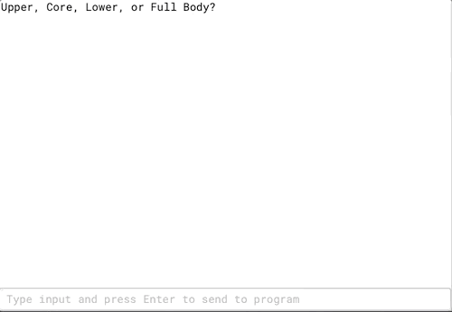
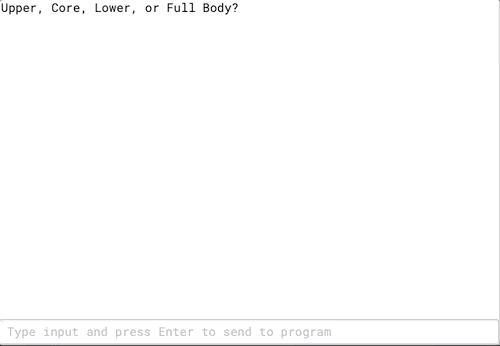

# PT Workout 

**PT Workout** is a muscle group specific workout generator made in Java.

## User Stories

The following functionality is complete:
* [X] User can pick from workouts focused on the upper body, lower body, or core.
* [X] User can select a full body workout with an emphasis in one muscle group
* [X] User can select between three different difficulty settings
* [X] User can select between three different workout length settings

## License

    Copyright 2020 Jonathan Singer

    Licensed under the Apache License, Version 2.0 (the "License");
    you may not use this file except in compliance with the License.
    You may obtain a copy of the License at

        http://www.apache.org/licenses/LICENSE-2.0

    Unless required by applicable law or agreed to in writing, software
    distributed under the License is distributed on an "AS IS" BASIS,
    WITHOUT WARRANTIES OR CONDITIONS OF ANY KIND, either express or implied.
    See the License for the specific language governing permissions and
    limitations under the License.